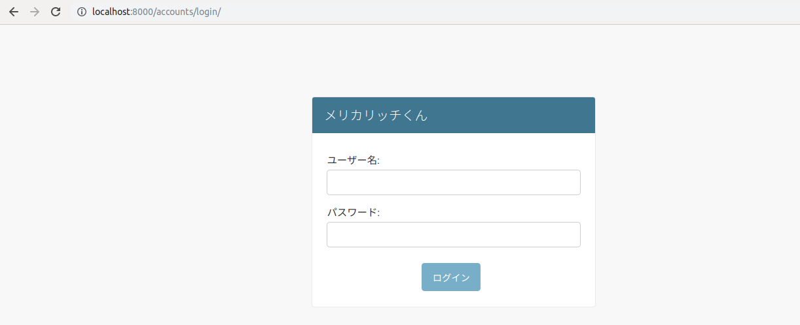
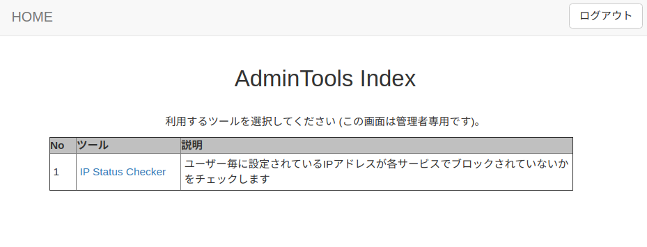
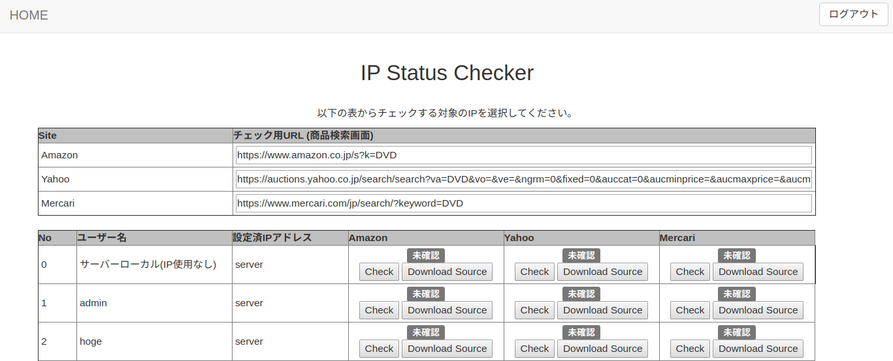
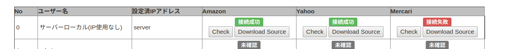

# AdminTools の使い方

ここでは Merucarich で利用される AdminTools の利用方法を説明する。

## ページの表示方法

Adminユーザー (/admin/ 以下にログインしてデータベースの操作ができるユーザー) のみが操作できる。
Adminユーザーで 通常のログインを行うと、AdminTools ページに移動する。

AdminTools ページから必要な項目を選んでツールを利用する。

## IP Status Checker 

特定IPを利用した場合、Amazon, Yahoo, Mercari にブロックされているか否かをチェックするツール。
ブロックされているか否かの判断にはスクレイパー（外部のページを取得するロジック）に組み込みのものを利用する。

実際の利用方法は以下の通り。

1. チェックしたいIPを持つユーザーの行を選ぶ
   - 設定済IPアドレスでユーザーに設定されているIPアドレスが確認できる
   - ユーザーにIPアドレスが設定されていない場合、設定済IPアドレスが server と表示される
   - 一番上の行はユーザーではなく、サーバーから直接チェックする (ユーザーにIPアドレスを設定していない場合と同じ)
   - 複数のIPアドレスを１ユーザーに設定している場合、IPアドレスの数だけ行が現れる
2. 該当IPからのアクセスに異常がないかをチェックする場合は「該当サービス」の「Check」ボタンを押す
   - 例えばAmazonへのアクセスでCAPTCHAが発生しているか否かをチェックする場合、Amazon列のCheckボタンを押す
   - どのサービスもアイテムの検索画面を利用しているので、対象アイテムを変えてチェックしたい場合は 一番上のチェック用URLの入力を別のものにする
   - ボタンを押すと「確認中...」という表示になる
3. 問題がない場合は「接続成功」、失敗した場合は「接続失敗」が表示される
4. 実際にどのようなページが表示されているかを確認したい場合は、特定IPアドレス行の「Download Source」ボタンを押す
5. 新しいタブに実際にどのような結果が得られたかが表示される
   - 例えばブロックされている場合などは、この中に「アクセス過多」などのメッセージが表示されるのでここを確認する

   

