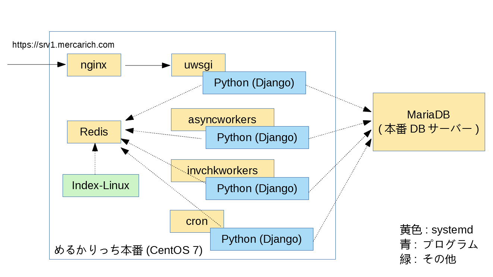

# Mercarich 動作環境

ここでは2020年7月21日現在の本番サーバー内の構成要素について述べる。
以後、このドキュメントが更新されない可能性もあるので、鵜呑みにはせず、参考として利用すること。

## 構成を確認したサーバー

* srv1.merucarich.com
* srv2.merucarich.com
* srv3.merucarich.com


## サーバーのインフラ

さくらのクラウドで動作している。


## サーバーへの接続

ssh を許可するために、固定IPが必要。
固定IPを伝えて、自分の環境からの ssh を許可するような設定を事前に行うこと。


## デプロイされているファイル

* `/var/www/richs/` 以下にプログラム (`*.py` など) が保存されている。
* owner:group は `richs:richs` で `755` あるいは `777` である必要がある。


## 利用されているミドルウェア

* nginx (/etc/nginx が設定ファイル)
* uwsgi (Pythonを実行)
* Maria DB (IPアドレスは settings.py を参照のこと)
* Redis (各サーバー上に導入されている)
* cron (定期的にジョブを実行)
* systemd (Linux上のサービス管理に利用)

また、メルカリへのアクセスには `localhost:1234` を利用しているが、このサービスは `index-linux` という名前で各本番サーバーにのみ立ち上がっている。

index-linuxの起動コマンドは以下の通り。 (SERVER部分は別途編集)

```
SERVER=srv1 DEBUG=ibiz:* NODE_ENV=production pm2 start /home/hai/index-linux
```

## サービス関連図




## サービスの立ち上げ

* `systemctl {start|stop|restart} nginx` : 前段のnginxを立ち上げ(停止)
* `systemctl {start|stop|restart} uwsgi` : PythonのWebサーバーを立ち上げ(停止)
* `systemctl {start|stopo|restart} asyncworkers` : 遅延処理で利用するワーカーの立ち上げ（停止）
* `systemctl {start|stopo|restart} invchkworkers` : 在庫チェックで利用するワーカーの立ち上げ（停止）

上記はいずれもLinux起動時に自動的に立ち上がる (`systemctl enable xxx`) 設定となっている。
これらの設定ファイルは `/etc/systemd/system/*.service` を参考のこと。


## Python環境

利用する環境は `/home/richs/.pyenv` 以下に存在する。

* `/home/richs/.pyenv/versions/3.6.7/bin/{python|pip}` それぞれ merucarich の実行/ライブラリ管理に利用する

なお、2019年7月20日の時点でコミットされている最新の `requrements.txt` を利用した pip install を実施している。


## 非同期ワーカーの情報

非同期ワーカーは `rq` という Python の Redis をキューとして利用する非同期実行フレームワークによって動いている。
現在のキューの情報は `rq` というコマンドで確認できる。

```bash
/home/richs/.pyenv/versions/3.6.7/bin/rq info
```

このコマンドで **asyncworkers** と **invchkworkers** で稼働させたワーカーとキューについてを見ることができる。


## cron設定

実行設定は全て `/etc/crontab` ファイル内に書かれている。
ここからバックグラウンドジョブを実行する。

プロセスを見ると `.../python manage.py` で動いているものが多くあるが、その多くがこれ。

スケジュールを更新する場合は `/etc/crontab` を書き換えた後に `systemctl restart crond` で再度設定を読み込ませること。


### check_item_{yahoo|mercari}

上記タスクは在庫チェックの事前チェックを行う。
もしオークションが終了していたり、メルカリ商品が売り切れていた場合は在庫の更新、あるいは取り下げを行う。

また、通常モードは「今回の実行で在庫が無くなったもののみ」が更新の対象とされるので、すでに在庫がなくなったと判断されたアイテムについては別途後述の更新バッチを実行する必要がある。

ユーザー毎に１日辺りの在庫チェック回数が決められており、2か4が用いられる。
2019年7月25日現在、2のみを用いており、cronで1日2回 (0時/12時) に起動される。

何らかの理由でPCの再起動が行われた場合などは、以下のコマンドで手動で起動可能。

```bash
# richs ユーザーで実行
su - richs 
# カレントディレクトリを変更
cd /var/www/richs
# 実行
python manage.py check_item_yahoo 2 4 --max-workers 14 &  >> /tmp/check_item_yahoo_12.log 2>&1
python manage.py check_item_mercari 2 4 --max-workers 14 &  >> /tmp/check_item_mercari_12.log 2>&1
```

なお、このバッチは多重起動させた場合、最後に起動したもののみを正とし、それ以外は終了するようなロジックが取られている。
この仕組みのため、強制終了した場合などは5分程度動作が開始されないことがある。


このバッチは **ジョブにメッセージを適量積む** だけであり、実際の処理は **invchkworkers** のサービスが行う。


### update_item_{yahoo|mercari}

在庫チェック仕様に基づき、１日２回実施。

チェック > 更新は非常に時間がかかってしまうため、事前チェックと実更新を明確に分離した。
このタスクは事前チェックで再検索が必要と判断されたアイテムに対して、別のアイテムを割り当てられないか(在庫復活)を確認する。

Yahooは 11時50分 / 23時50分 の1日2回。 メルカリは 8時50分 / 20時50分 にぞれぞれ cron で起動される。
何らかの理由でPCの再起動が行われた場合などは、以下のコマンドで手動で起動可能。

```bash
# richs ユーザーで実行
su - richs 
# カレントディレクトリを変更
cd /var/www/richs
# 実行
python manage.py update_item_yahoo 2 4 --max-workers 14 &  >> /tmp/update_item_yahoo_12.log 2>&1
python manage.py update_item_mercari 2 4 --max-workers 14 &  >> /tmp/update_item_mercari_12.log 2>&1
```

なお、このバッチは多重起動させた場合、最後に起動したもののみを正とし、それ以外は終了するようなロジックが取られている。
この仕組みのため、強制終了した場合などは5分程度動作が開始されないことがある。

このバッチは **ジョブにメッセージを適量積む** だけであり、実際の処理は **invchkworkers** のサービスが行う。


### update_feed_{yahoo|mercari}

feedを更新(Amazon上の商品の更新)を実施する。 
yahoo, amazonともに10分おきに行われている。

AmazonAPIの登録がうまくいっていない場合、このロジックで商品の在庫が更新できない点に注意。


### Environment Update

DB上に設定されている環境変数をローカルの `.env` に落とし込む処理。
遅延処理ワーカーの個数を動的に制御するために実施。

```bash
30 23  *  *  * richs  /bin/bash -cl "cd /var/www/richs && /bin/bash accounts/bin/update_env.sh" >> /tmp/update_env.log 2>&1
```

### Delete Old items

在庫0のまま、更新されなくなったであろうアイテムを削除する。
PythonのItem削除を行うことで、サーバー上にある画像をまとめて消すことができる(詳しくは YahooToAmazonItem の delete 処理部分を参照)。

```bash
45 2  *  *  * richs  /bin/bash -cl "cd /var/www/richs && /home/richs/.pyenv/shims/python manage.py delete_old_items --expired-days 7" >> /tmp/delete_old_items.log 2>&1
```

### Background Jobs

一括処理ワーカーが何らかの理由（主にバグ）で動作しなくなってしまい、特定ユーザーの一括検索が全く進まない状態になることがある。
これを単に「フリーズ」と呼んでいるため、注意。

このフリーズを回避するための定期チェックバッチが実行されている。

```bash
*/8 * * * * root /bin/bash -cl "cd /var/www/richs && /bin/bash accounts/bin/check_background_jobs.sh" >> /tmp/check_background_jobs.log 2>&1
```

### MWS token validation

ユーザーが登録している Amazon API がいつの間にか無効になっていることがある。
これを素早く検知するために、チェック用のバッチが動作している。

```bash
33 */4  *  *  * richs  /bin/bash -cl "cd /var/www/richs && /home/richs/.pyenv/shims/python manage.py validate_mws_tokens" >> /dev/null 2>&1
```


## ログローテーション

システムのログは /etc/logrotate.d/merucarich に指定された方法でログローテーション + サービスの再起動を行っている。


以上。

